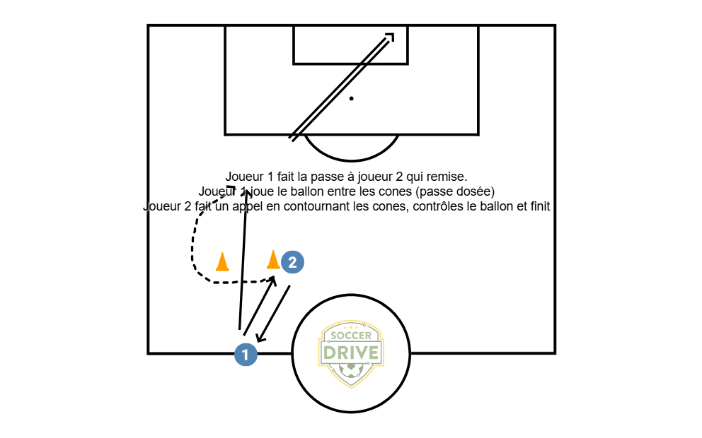

# Drill : Passe en profondeur et appel

## Objectif
- Enchaîner **appui-remise + passe dosée dans la course + appel + contrôle orienté + finition**.

## Organisation
- **Joueurs** : 2 (faire 2 à 4 ateliers identiques si effectif important).
- **Matériel** : 2 cônes (porte), 1 ballon, 1 but (ou mini-but) par atelier.
- **Espace indicatif U8** : 10–15 m de profondeur, largeur 6–8 m.

## Déroulé
1. Joueur 1 fait la passe à Joueur 2 (appui).
2. Joueur 2 remet (une touche si possible).
3. Joueur 1 joue une **passe dosée** entre les cônes (porte) dans la course.
4. Joueur 2 déclenche l’**appel** en contournant la porte, **contrôle orienté** vers le but et **frappe**.
5. On change de rôles toutes les 3–4 répétitions.

## Points de coaching (1 consigne à la fois)
- **Passe dosée** : ballon au sol, cheville verrouillée, viser l’espace (pas le joueur).
- **Timing de l’appel** : partir quand le passeur se prépare à jouer.
- **Contrôle** : première touche vers l’avant (vers le but).
- **Finition** : tir au sol pour la précision.

## Variantes
- Simplifier : supprimer la remise (passe directe dans la course) si trop complexe.
- Complexifier : imposer remise 1 touche + tir 1 touche (si niveau OK).
- Ajouter un défenseur passif (plot humain) après le contrôle pour « gêner ».
